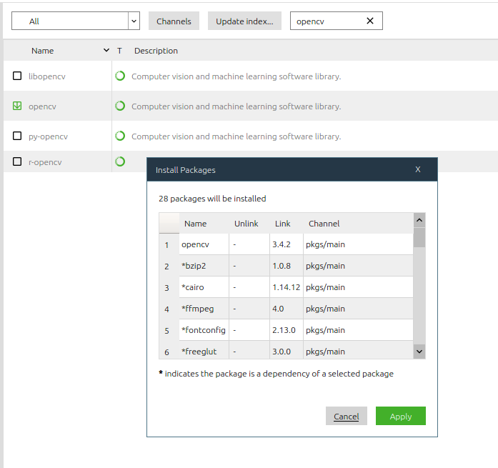

##  Ubuntu下深度学习环境配置
### 一.装双系统
[参考一](https://blog.csdn.net/www_helloworld_com/article/details/84672165)
[参考二](http://teliute.org/linux/Ubsetup/index.html)
####    查看硬盘分区模式
我的电脑——管理——磁盘管理——磁盘右击选择属性——卷，我的磁盘是GPT分区
（注：在GPT硬盘格式下其实是没有什么主分区和逻辑分区区别的，都是主分区，所以我把分区类型都设为主分区。）

####    查看启动方式：
按Win+R打开运行，输入msinfo32，回车查看系统信息。在BIOS模式中如果显示“传统”，表示系统启动方式为Legacy BIOS;如果为UEFI，则显示UEFI。

至此，明确了我的电脑是UEFI+GPT

之前做过启动盘的U盘恢复成非启动盘：
在磁盘管理中删除卷、格式化即可。

关闭快速启动（电源设置）和安全启动（BIOS）

注意：要安装系统的磁盘要处于空闲状态，即被删除的状态

### 二.安装NVIDIA驱动
NVIDIA驱动即CUDA driver version驱动版本(与之相对应的是CUDA runtime version运行时版本)，也就是说NVIDIA不能随便装，要根据选用的CUDA版本去安装，下图是版本对应关系

CUDA我准备装10.0版本，所以NVIDIDA驱动我要安装大于410.48版的，这里我选择官网的430.64版。
一开始是现将驱动包下下来（网速很慢，下了半天），然后再安装，不过发现安装失败，出现下面的情况，所以放弃。
```bash
Verifying archive integrity... Error in check sums xxxxxxx xxxxx
```
最后准备使用**PPA源下载**的方式安装：
```bash
sudo add-apt-repository ppa:graphics-drivers/ppa  
sudo apt-get update  
sudo apt-get install nvidia-430 #此处要根据上面查询到的版本适当更改
sudo apt-get install mesa-common-dev  
sudo apt-get install freeglut3-dev
```
上面的430是通过[NVIDIA驱动查找](https://www.geforce.cn/drivers)找到的
重启
```bash
nvidia-smi  #若出现电脑GPU列表，即安装成功
```
[CUDA、显卡驱动和Tensorflow版本之间的对应关系](https://blog.csdn.net/IT_xiao_bai/article/details/88342921)
### 三.CUDA安装
[参考链接](https://blog.csdn.net/wanzhen4330/article/details/81699769#%E7%AE%80%E5%8D%95%E6%96%B9%E6%B3%95%E2%80%94%E2%80%94%E4%B8%8D%E5%B8%A6%E9%A9%B1%E5%8A%A8)
官网下的CUDA包中自带NVIDIA驱动，上面已经安装好了，所以在安装CUDA的时候需要注意是**不带驱动安装**
```bash
sudo sh cuda_xxxxx_linux.run#注意在driver处选择n
```
在home下打开.bashrc文件（ctrl+H显示隐藏文件），在最下面添加如下
```bash
export LD_LIBRARY_PATH=$LD_LIBRARY_PATH:/usr/local/cuda-10.0/lib64
export PATH=$PATH:/usr/local/cuda-10.0/bin
export CUDA_HOME=$CUDA_HOME:/usr/local/cuda-10.0
```

### 四.cuDNN安装
[参考链接](https://www.cnblogs.com/pertor/p/8733010.html)
cuDNN下载是Linux那个版本，不是Ubuntu的版本
```bash
1 tar -zxvf cudnn-10.0-linux-x64-v7.6.5.32.solitairetheme8.tgz 
2 sudo cp cuda/include/cudnn.h /usr/local/cuda/include/ 
3 sudo cp cuda/lib64/libcudnn* /usr/local/cuda/lib64/ -d 
4 sudo chmod a+r /usr/local/cuda/include/cudnn.h 
5 sudo chmod a+r /usr/local/cuda/lib64/libcudnn* 
```
### 五.Anaconda安装
安装完Anaconda之后每次打开终端，开头都会有base，表明每次都自动进入了虚拟环境，使用下面的指令可以关闭自动进入。
```bash
conda config --set auto_activate_base false
```
安装完后发现终端输入
```bash
whereis python
```
找不到anaconda中的python，说明环境变量没有配好
输入
```bash
sudo gedit ~/.bashrc
```
在最后输入
```bash
export PATH="/home/gong/anaconda3/bin:$PATH"
```
然后
```bash
source ~/.bashrc
```
完成Anaconda环境变量的配置
### 六.TensorFlow安装
创建虚拟环境
```bash
conda create -n tf
```
激活环境
```bash
conda activate tf
```
关闭环境为
```bash
conda deactivate
```
安装指定版本
```bash
conda install tensorflow-gpu=1.15
```
漫长的等待～可以去做个饭
吃完回来，继续等待
在下载链表中发现它居然还下载了cudo-10和对应的cudnn。
下载完成，在python环境下输入
```bash
import tensorflow as tf
```
不报错说明安装成功。
在pycharm中查看CUDA和GPU是否可用：
```bash
tf.test.is_built_with_cuda()
tf.test.is_gpu_available()
```
参考：
1.[ubuntu16.04下安装&配置anaconda+tensorflow新手教程](https://blog.csdn.net/m0_37864814/article/details/82112029)
2.[Ubuntu16.04环境下从Anaconda3安装到Tensorflow(gpu)及pycharm安装和测试mnist完整教程](https://blog.csdn.net/weixin_40362972/article/details/79838662)
### 七.PyCharm安装
ctrl+shift+F10可以为当前py自动配置config并且运行
### 八.Opencv安装
####    失败一
直接打开Anacon

运行代码时出现
```bash
Rebuild the library with Windows, GTK+ 2.x or Carbon support
```
需要先执行
```bash
sudo apt-get install libgtk2.0-dev
```
再安装opencv,最后发现还是没解决，猜测Anaconda下载的opencv本身是阉割版本，需要自己手动编译opencv
####    失败二
讲两个opencv包从github下下来后，建立build文件夹，终端进入tf虚拟环境，输入
```bash
cmake -D WITH_TBB=ON -D BUILD_NEW_PYTHON_SUPPORT=ON -D CMAKE_INSTALL_PREFIX=/usr/local -D WITH_V4L=ON -D WITH_OPENGL=ON -D WITH_VTK=ON .. -D CMAKE_BUILD_TYPE=RELEASE -D OPENCV_EXTRA_MODULES_PATH=/home/gong/opencv3/opencv_contrib/modules -D WITH_IPP=OFF -D PYTHON_DEFAULT_EXECUTABLE=/home/gong/anaconda3/envs/tf/lib/python3.7 -D BUILD_opencv_python3=ON -D BUILD_opencv_python2=OFF -D PYTHON3_EXCUTABLE=/home/gong/anaconda3/envs/tf/lib/python3.7 -D PYTHON3_INCLUDE_DIR=/home/gong/anaconda3/envs/tf/include/python3.7m -D PYTHON3_LIBRARY=/home/gong/anaconda3/envs/tf/lib/libpython3.7m.so.1.0 -D PYTHON_NUMPY_PATH=/home/gong/anaconda3/envs/tf/lib/python3.7/site-packages -D BUILD_EXAMPLES=ON -D PYTHON3_PACKAGESS_PATH=/home/gong/anaconda3/envs/tf/lib/python3.7/site-packages -D BUILD_LIBPROTOBUF_FROM_SOURCES=ON -D BUILD_opencv_hdf=OFF ..
```
中间出现了很多的包下载失败，原因是外网访问被拒绝，虽然最后出现了下图的完成。

然后输入
```bash
make -j8
```
到15%的时候，失败：
```bash
Makefile:160: recipe for target ‘all’ failed
```
####    成功
```bash
conda remove opencv
conda install -c menpo opencv
pip install --upgrade pip
pip install opencv-contrib-python
```
这里用了手机热点，网速快，不然用公寓的wifi下不下来
虽然下载成功，同时代码运行也没有问题，但是这里的

版本不一致，估计以后还会爆坑
### 九.额外收货
####    1.修改默认使用的python版本
Ubuntu默认有两个python版本，2.7.12和3.5.2，默认使用的2.7.12，通过
```bash
echo alias python=python3 >> ~/.bashrc
source ~/.bashrc
python --version
```
可将python2改为python3
####    2.安装pip和pip3
```bash
sudo apt-get install python-pip
pip -V

sudo apt-get install python3-pip
pip3 -V
```
####    3.一些必备
[Chrome无VPN安装](https://blog.csdn.net/Muleung/article/details/80623533)


####    4.知识点
Anaconda是python的一个发行版
### 十.结尾
至此，通过两个下午加两个晚上的努力，最终实现了在Ubuntu系统中成功安装NVIDIA驱动、CUDA、cuDNN、Anaconda、TensorFlow、Pycharm、Opencv的安装，为深度学习打下了环境基础。